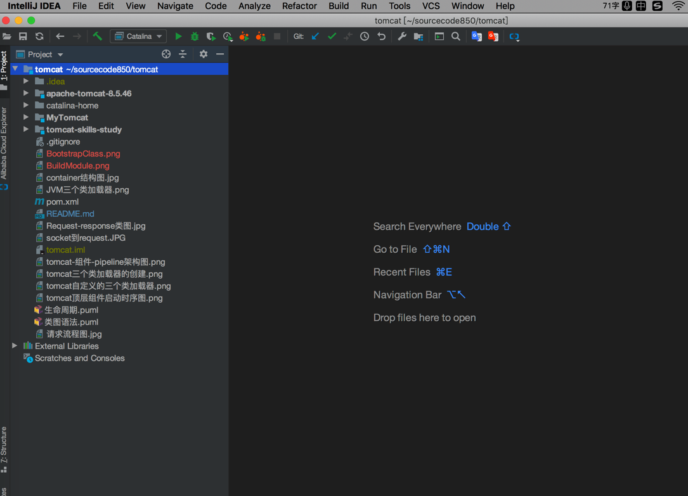
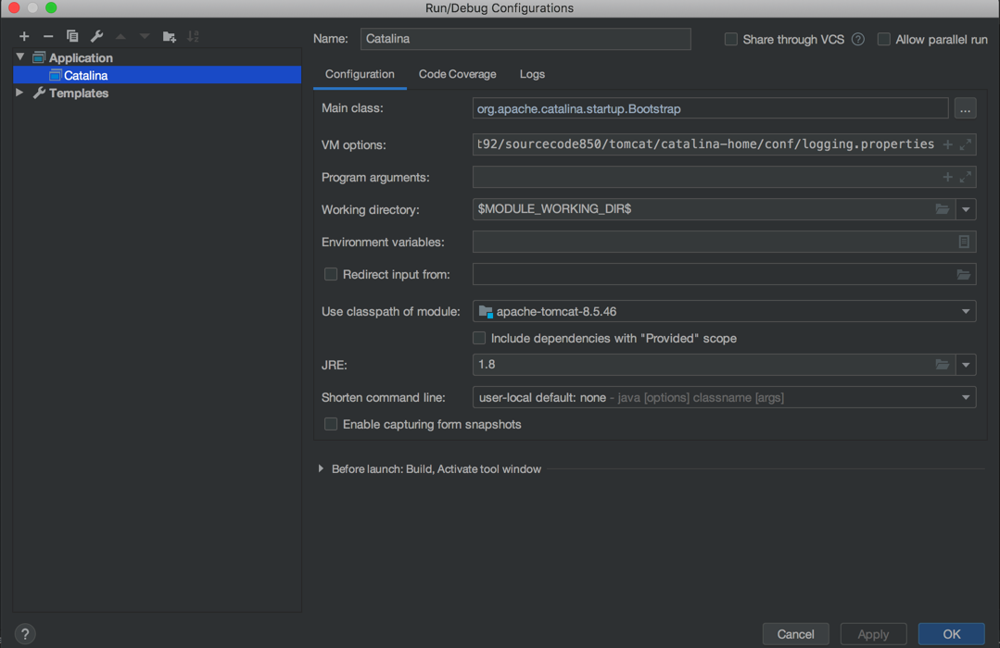
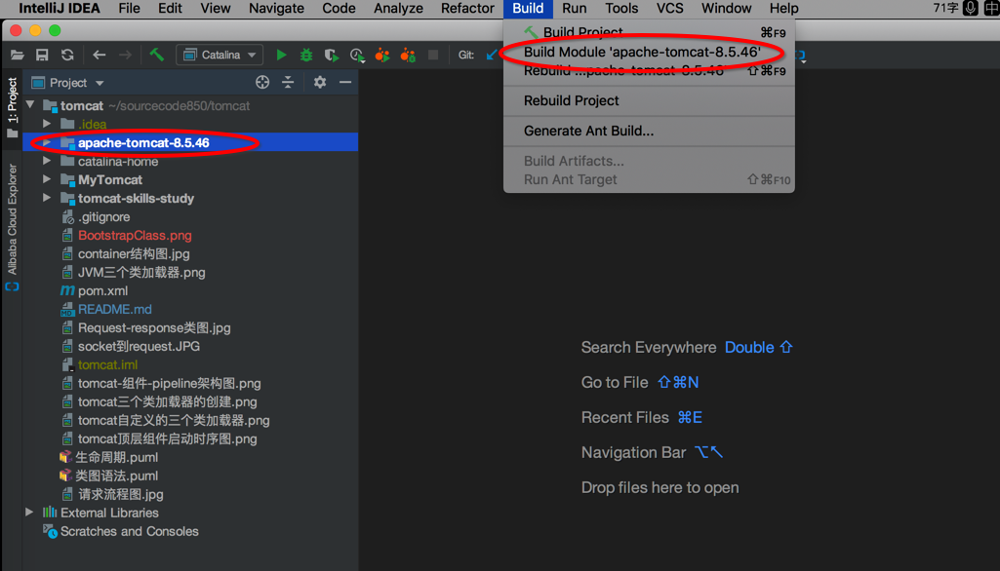

# 导入idea


## 直接使用open打开项目



##  配置启动类




```Java
VMoptions参数：
-Dcatalina.base=catalina-home
-Dcatalina.home=catalina-home
-Djava.endorsed.dirs=catalina-home/endorsed
-Djava.io.tmpdir=catalina-home/temp
-Djava.util.logging.manager=org.apache.juli.ClassLoaderLogManager
-Djava.util.logging.config.file=catalina-home/conf/logging.properties

catalina-home是tomcat配置文件，生成文件存放目录
上述的VM options里面的catalina-home相关的配置都使用绝对路径
```

## Build项目

选中`apache-tomcat-8.5.46`，点击Build下面的`Build Module 'apache-tomcat-8.5.46'`



```shell
关于Mac系统Build模块之后，.xml和.properties等资源文件无法编译进去的解决方案，在apache-tomcat-8.5.46模块根目录下面执行`mvn resources:resources`	命令即可
```


# MyTomcat

是自己实现的简易版tomcat

# tomcat-skills-study
是学习tomcat的一些手法


# apache-tomcat-8.5.46
是tomcat源码及版本号
